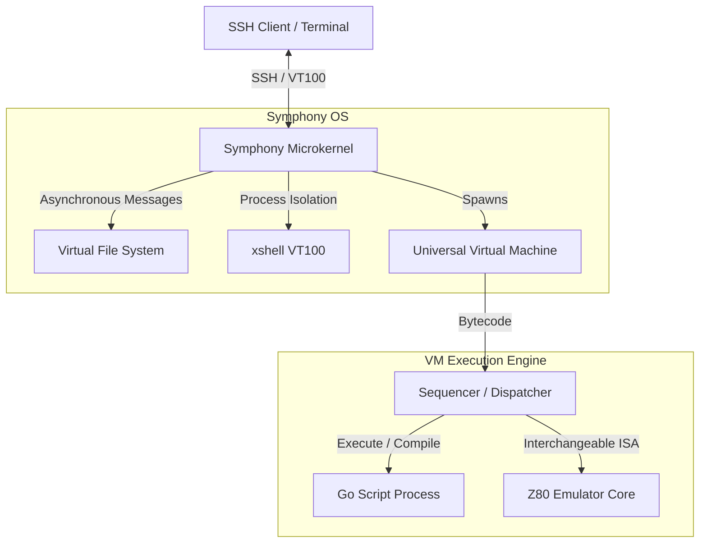
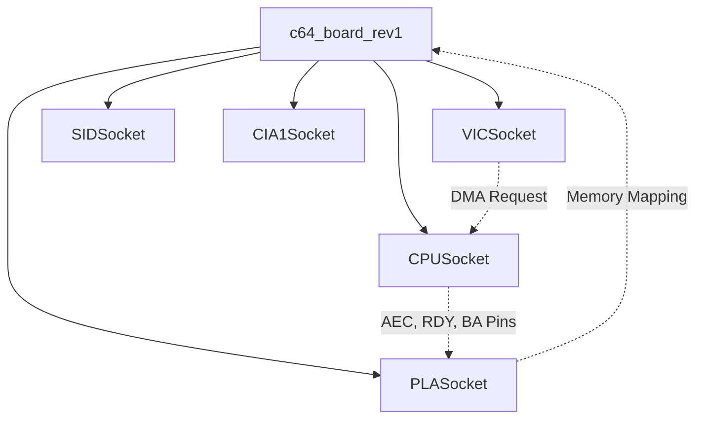

# Symphony: The Transparent Systems Framework

[](https://go.dev/)
[](https://www.gnu.org/licenses/old-licenses/lgpl-2.1.en.html)
[](https://goreportcard.com/report/github.com/markel1974/symphony)

**Symphony is not just an emulator. It is a complete ecosystem for exploring, building, and introspecting computing systems.**

Born from a frustration with "black box" emulator designs and opaque backend services, Symphony is a highly modular, open-source framework written purely in Go. It allows you to build complex software and hardware architectures that are transparent, inspectable, and manipulable in real-time by design.

---

## 🏛️ The Three Pillars of Symphony

Symphony is built upon three distinct but perfectly integrated architectural pillars:

### 1. The Microkernel OS
At its core, Symphony is a **microkernel operating system**. It features an asynchronous message router that manages isolated user-space processes. It comes with a built-in SSH server, a VT100 retained-mode window manager, and a virtual filesystem. You can SSH into the running kernel and perform "open-heart surgery" on running processes without stopping the system.

### 2. The Universal VM & Native Compiler
Symphony includes a robust **multi-pass compiler** that translates a large subset of the Go language into a custom intermediate bytecode. This bytecode is executed by a high-performance **Virtual Machine**. 
The VM uses an "Interchangeable Instruction Disk" architecture: it relies on the Strategy Pattern (via `ISequencer` and `IOpExecutor`) rather than a monolithic switch-case. This means the VM can seamlessly transition from running high-level Go scripts to acting as a cycle-accurate Z80 or MOS6510 CPU emulator, simply by swapping the instruction set module. 

### 3. Topological Hardware Emulation
Hardware is not simulated via high-level traps or software hacks. Symphony models hardware topologically—like a software breadboard. Components (like the VIC-II, SID, PLA, and CPU) are isolated "black boxes" that communicate exclusively through standardized `ISocket` interfaces via electrical signals (e.g., pulling the DMA line low to trigger High-Z states on the bus).
Currently, Symphony implements a full **Commodore 64** and an independent **1541 Floppy Drive** (which runs as a completely separate parallel computer over a simulated IEC serial bus).

---

## 🗺️ Architecture Overview

### The Ecosystem


### The Topological Component Tree (C64 Example)


---

## ✨ Key Features

* **Live Introspection (WYSIWYG)**: Connect via SSH to the running kernel and inspect or modify the state of *any* component (CPU registers, variables, audio channels) at runtime using the `xshell`.
* **Snapshot = State + Configuration**: A single snapshot defines the entire hardware topology and its exact runtime state. Build, save, load, and share complex machine setups easily.
* **Cycle-Accurate Timing**: Hardware components (like the VIC-II and SID) respect the strict physical timing constraints of the original silicon.
* **100% Pure Go**: No CGo dependencies, ensuring memory safety, immediate cross-compilation, and high portability.
* **Headless by Default**: Designed to run cleanly on servers without requiring a GPU or Audio interface, making it perfect for automated testing and CI/CD.

---

## 🚀 Getting Started

Symphony requires **Go 1.21+** to build.

### Building from Source
Clone the repository and build the binary:

```bash
git clone https://github.com/markel1974/symphony.git
cd symphony
go build -o symphony main.go
```

### Running Symphony

Run the default Commodore 64 configuration with an OpenGL renderer:
```bash
./symphony -r gl -m c64
```

Run in completely headless mode (perfect for SSH exploration):
```bash
./symphony -r none -a none -m c64
```

*(Note: SSH credentials and port configuration are managed via the OS configuration files. Check the `src/kernel` documentation for connection details).*

🚀 Try Symphony Live in Your Browser! 🚀
https://markel1974.itch.io/symphony